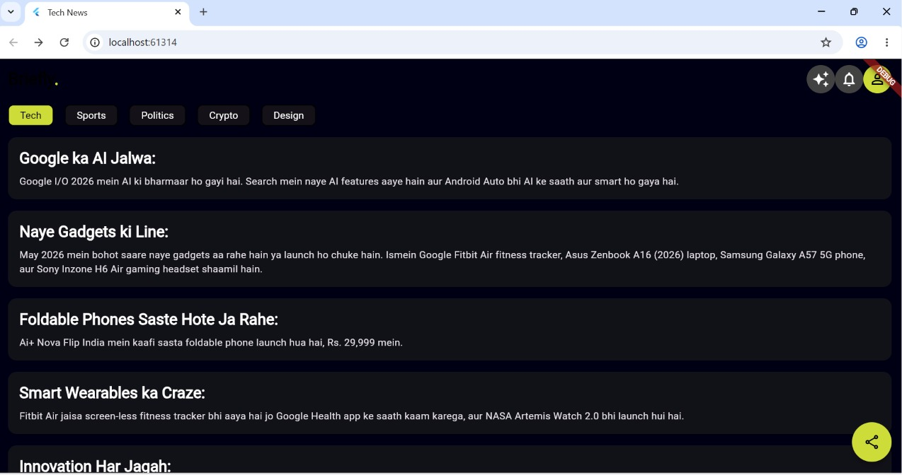
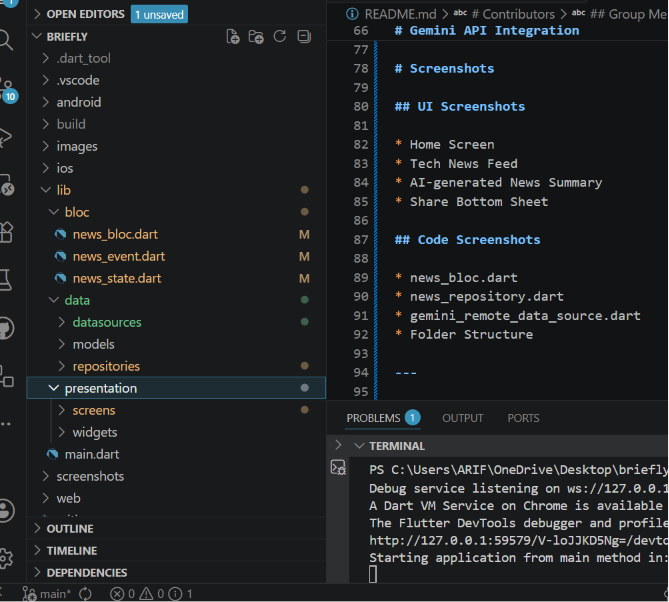
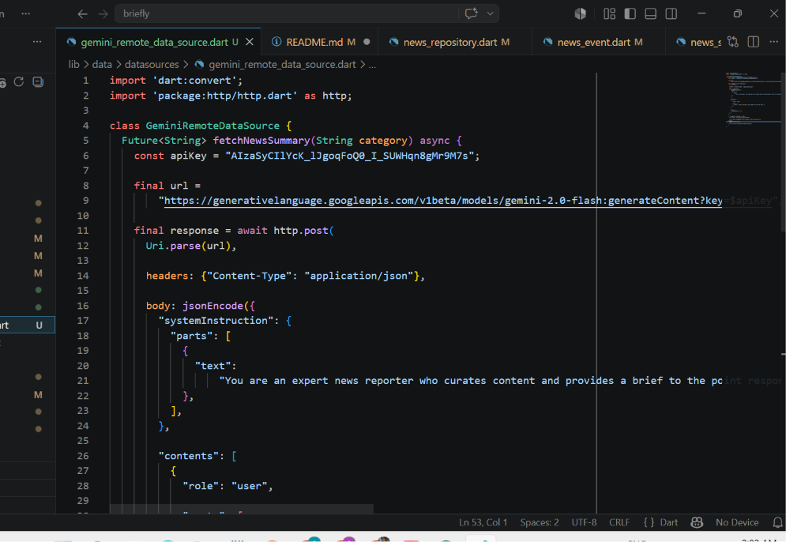
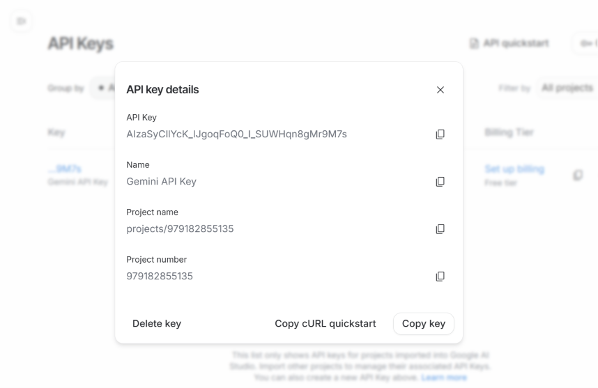
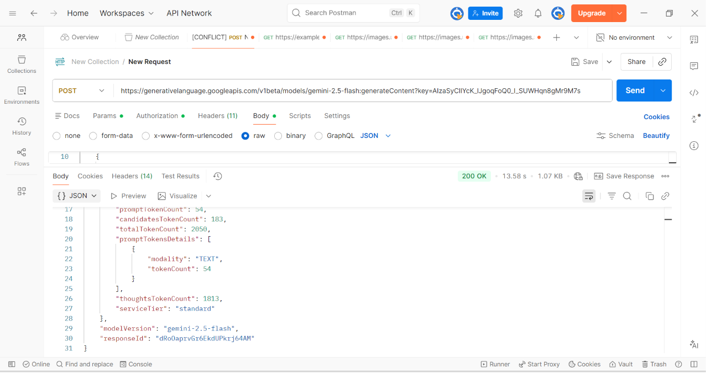

# Briefly AI – Tech News Summary App

## Overview

Briefly AI is a Flutter-based news application developed using the Bloc Architecture pattern.

This project integrates the Gemini API as an additional remote data source to generate AI-curated summaries of the latest technology news in Roman Urdu Korangi slang style.

The application fetches and displays concise tech news summaries while maintaining a clean and scalable architecture using Bloc State Management and Repository Pattern.

---

# Features

- Flutter Bloc Architecture
- Repository Pattern
- Gemini API Integration
- AI-generated Tech News Summaries
- Roman Urdu Korangi-style Responses
- Pull-to-Refresh Support
- Responsive UI
- Clean Folder Structure

---

# Technologies Used

- Flutter
- Dart
- Flutter Bloc
- HTTP Package
- Gemini API (Google AI Studio)

---

# Architecture

The project follows a layered architecture:

```plaintext
lib/
│
├── bloc/
│   ├── news_bloc.dart
│   ├── news_event.dart
│   └── news_state.dart
│
├── data/
│   ├── datasources/
│   │   ├── news_remote_data_source.dart
│   │   └── gemini_remote_data_source.dart
│   │
│   ├── models/
│   │   └── news_item.dart
│   │
│   └── repositories/
│       └── news_repository.dart
│
├── presentation/
│   ├── screens/
│   └── widgets/
│
└── main.dart
```

---

# Gemini API Integration

Gemini API was integrated as an additional remote data source.

The application sends prompts to Gemini API and receives AI-generated summaries for the latest technology news.

## Example Prompt

```plaintext
Give 5 short latest tech news bullet points.
```

---

# Setup Instructions

## 1. Clone Repository

```bash
git clone <your-forked-repo-link>
```

---

## 2. Open Project

Open the project in VS Code or Android Studio.

---

## 3. Install Dependencies

```bash
flutter pub get
```

---

## 4. Run Application

```bash
flutter run
```

---

# Contributors

## Group Members

- Anum Arif
- Muhammad Arham Shaikh
- Usman Nadeem
- Kirty Roy

---

# Learning Outcomes

Through this project we learned:

- Bloc State Management
- Repository Pattern
- API Integration in Flutter
- Gemini AI Integration
- Clean Architecture Principles
- Handling Async API Calls
- Managing Application States

---

# Conclusion

This project successfully demonstrates the integration of AI-powered news summarization into a Flutter application while maintaining scalable architecture using Bloc and Repository Pattern.

---

# Screenshots

## Home Screen



---

## Bloc Architecture



---

## Code Screenshot



---

## Gemini API Key Setup



---

## Postman API Testing



